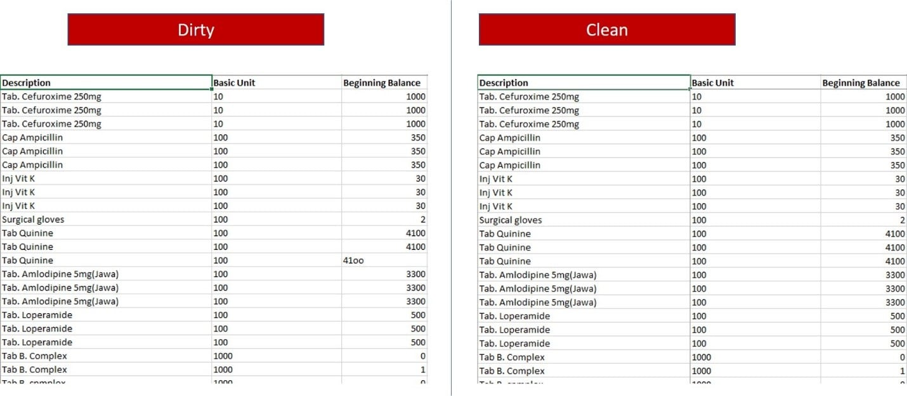

```markdown

Info :

This data was collected by non-data-centric professionals. They have sometimes used letters in place of some numbers. Like using letter S in place of Number 5. When you are done with this, your numbers should sum up to that shown on the clean data from the download.


Reference : https://foresightbi.com.ng/microsoft-power-bi/dirty-data-samples-to-practice-on/
```

