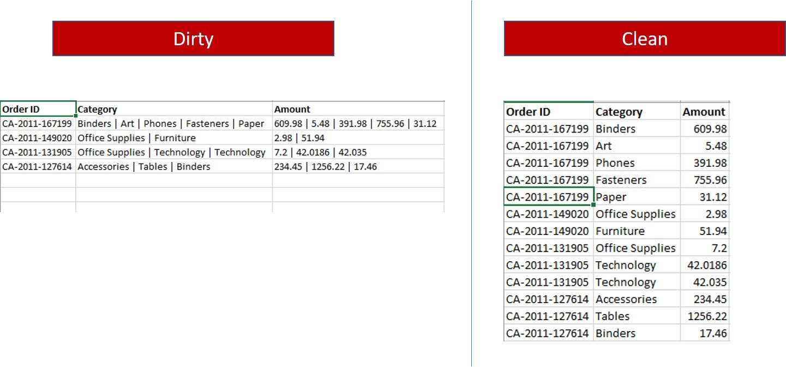

```markdown

Info :

Because a single transaction (identified with an order id ) has multiple items purchased, who ever captured this data decided to create a single row for each order, thereby lumping the different items purchased and the amounts together into 2 fields respectively.

The better thing to do is to let each item purchased be on a single row with the amount. It is better to repeat the Order IDs on different rows than lumping up amounts in a single cell. We would be analyzing items bought and amounts a lot, we need them separated into rows.


Reference : https://foresightbi.com.ng/microsoft-power-bi/dirty-data-samples-to-practice-on/
```


