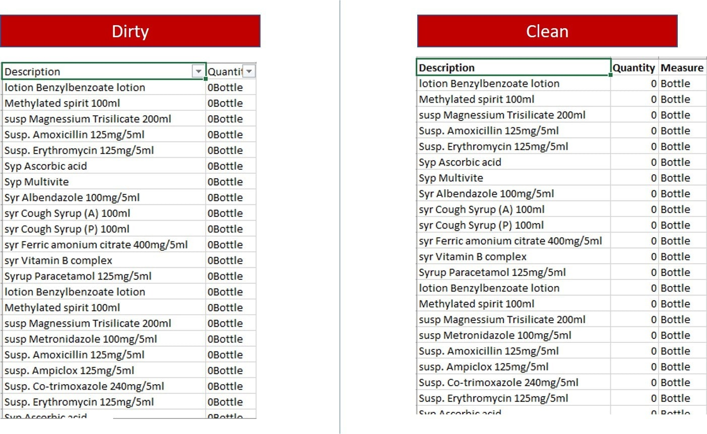

```markdown

Info :

Going by clean data rules, you should have every field/column represent unique things. So split the combined Quantity and Measure on this data into separate columns/fields. When you are done, your Quantity column should sum up to 17,600.00. You will find this total on the clean worksheet once you download.


Reference : https://foresightbi.com.ng/microsoft-power-bi/dirty-data-samples-to-practice-on/
```


